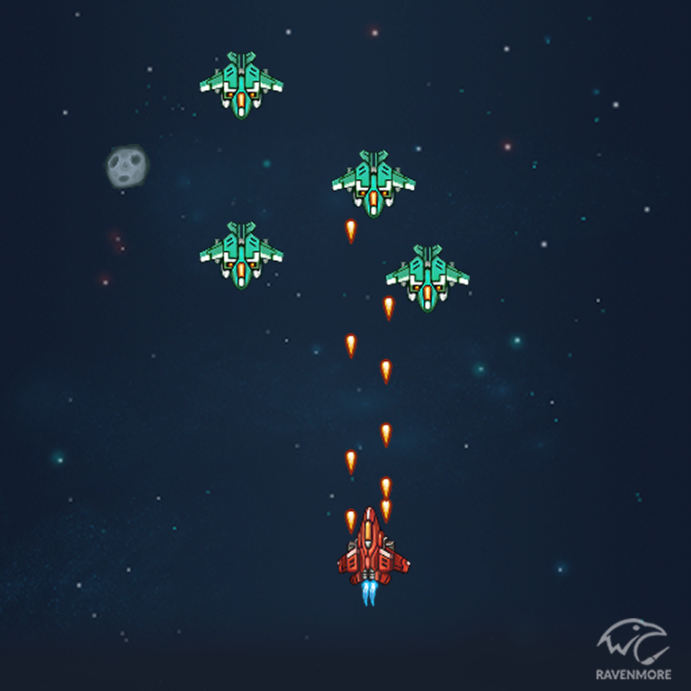

# 2021 SmartPhoneGameProgramming Term Project

# 개요
안드로이드 용 2D 종스크롤 슈팅게임

# 게임 컨셉
우주에서 여러가지 아이템의 도움을 받으며 장애물들을 피하고
적들을 처치해 나가는 게임
* 화면 상단에서 적들과 장애물이 등장함.
* 이로운 아이템이 랜덤으로 등장함.
* 장애물 또는 적이랑 충돌하면 목숨이 줄어들고 목숨이 0이되면 게임오버.
* 플레이어는 적 또는 장애물을 피하거나 총알을 발사하여 파괴 할 수 있음.
* 게임 시간이 오래 지날 수록 더 많은 적들이 등장하고 더 강한 적들이 등장함.

# 조작법
* 캐릭터 움직임 : 캐릭터를 터치한 상태로 좌우상하로 드래그.

# 플레이 장면(예시)

### 게임 흐름도

# 오브젝트

|구분|내용|이미지|
|-------|---|------|
|캐릭터|좌우 상하로 움직이며 총알을 발사함.|
|적군 1|위에서 아래로 움직이며 좌우로 느리게 움직임. 초록, 청록, 빨강 순으로 체력이 높음.|
|적군 2| 위에서 아래로 빠르게 움직임. 초록, 청록, 빨강 순으로 속도가 빠름.|
|운석|좌우로 화면에 팅기면서 움직이며 총알에 맞을 시 두개로 분할되고 더 이상 분할되지 않음. |
|Health Item |플레이어와 충돌시 플레이어의 목숨이 1 증가함.|
|PowerUp Item |플레이어와 충돌시 플레이어의 총알의 크기 및 속도가 증가함.|

# 개발 범위
 |구분|내용|
|------|---|
|캐릭터|상하좌우 이동 및 공격의 캐릭터 상태 구현
|아이템|목숨증가 및 파워업 아이템을 구현
|적| 상하좌우로 움직이는 2개의 형태의 적기를 구현
|장애물|좌우로 움직이고 분할되는 운석을 구현

# 개발 일정

|주차|내용|진행률| 커밋 횟수 |
|------|---|----| ----|
|1주차|이미지 및 사운드 리소스 수집 | 100%| 13회|
|2주차|캐릭터의 기본 움직임 구현| 100%|4회|
|3주차|적군의 움직임 및 상호작용 구현| 100%|4회|
|4주차|아이템 및 상호작용 구현| 100%|6회|
|5주차|장애물 움직임 및 상호작용 구현| 100%|2회|
|6주차|사운드 및 효과음 구현| 100%|9회|
|7주차|캐릭터 상태 및 점수를 표시하는 UI를 구현| 100%|1회|
|8주차|메인화면, 게임화면, 게임오버화면을 구현 | 100%| 4회 |
|9주차|버그 수정 및 게임 테스트| 100%| 4회 |

# 사용된 기술
## 수업에서 차용한것
- 충돌체크
- 게임 씬
- 오브젝트 리사이클링
- 백그라운드 스크롤링
- 비트맵, 사운드 로딩 및 캐싱
- ## 직접 개발한것
- 게임 로직
- 선형보간을 이용한 이동
- SpriteSheet의 Subregion 데이터를 Json파일로부터 불러오는것
- 씬과 독립된 렌더러를 만들고 각각의 비트맵을 그릴 때 draw order를 주고 이에 따라 순서대로 그려지게함.

## 아쉬운점
- 아이디어 부족
- 보스 몬스터
- 리소스를 구하는게 생각보다 힘듦
- 완성도 있는 오브젝트 시스템 (예)컴포넌트 기반 오브젝트)

# Insights

# GameObject overview

